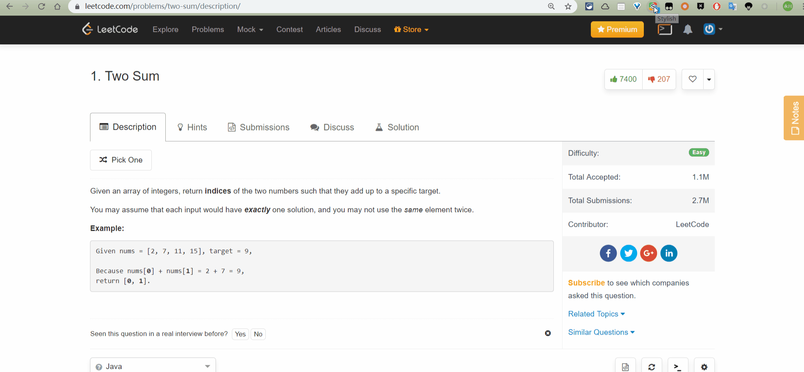
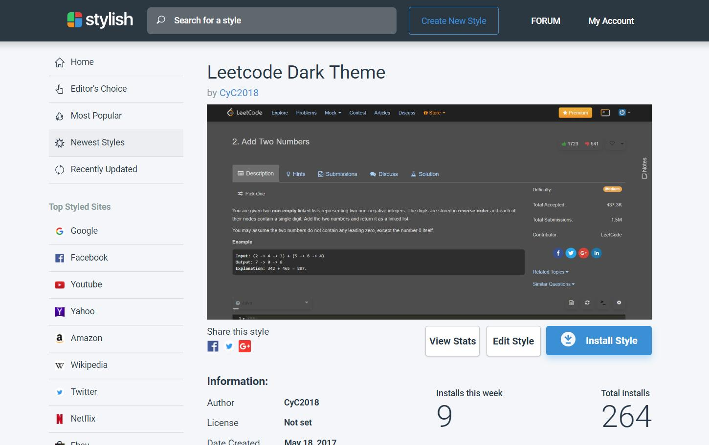

    

# Preview

 

# Usage

- Install [Stylish](https://userstyles.org/) plug-in in the browser.
- Go to [Leetcode Dark Theme](https://userstyles.org/styles/142782/leetcode-dark-theme), and click installs button. 
- Change Code Editor Settings in Leetcode.

